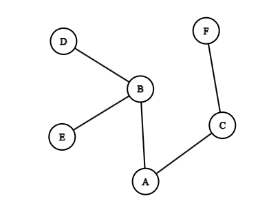

# Breadth-first Search (BFS)

As its name says, BFS starts from the source node and explores all its neighbors at the present depth level before moving on to nodes at the next depth level.

While BFS is typically used to search for something, it can also be a means of iterating over a set of data.

## Pseudocode

```
BFS(source, target) {
  initialize empty queue
  initialize set for visited nodes
  
  enqueue source to queue
  
  while queue is not empty {
    current = dequeue queue
    if current is target {
      return true
    }
    if current is not in visited {
      mark current as visited
      for every neighbor of current {
        if neighbor is not in visited {
          enqueue neighbor to queue
        }
      }
    }
  }
  return false
}
```

## Step-by-step

Consider the graph below



Let our source be A.

- Enqueue A (starting node) to the queue.
- Dequeue A and enqueue its neighbors B and C.
- Dequeue B and enqueue its neighbors D and E.
- Dequeue C and enqueue its neighbor F.
- Dequeue D, which has no unvisited neighbors.
- Dequeue E, which has no unvisited neighbors.
- Dequeue F, which has no unvisited neighbors.

Our exploration path is A - B - C - D - E - F

### Time Complexity

- O(V + E) Where V is the number of vertices and E is the number of edges in the graph.
  - In the worst case, BFS visits all vertices and edges. For each vertex, it checks all adjacent vertices (edges).

### Space Complexity

- O(V) The space complexity is primarily due to the queue used for storing nodes during the traversal. In addition, space is needed for storing the visited nodes.
  - In the worst case, the queue can hold all vertices in the graph.

### Advantages of BFS

1. **Shortest Path**:
   - BFS finds the shortest path between the source node and the target node in an unweighted graph.

2. **Layer-wise Traversal**:
   - BFS explores nodes layer by layer, making it useful for level-order traversal in trees.

3. **Connected Components**:
   - Can help in finding connected components in a graph.

4. **Cycle Detection**:
   - Can be used to detect cycles in an undirected graph by checking for back edges.

### Disadvantages of BFS

1. **Memory Usage**:
   - BFS can require a lot of memory, especially if the graph is wide, as it needs to store all nodes at the current level.

2. **Not Suitable for Deep Graphs**:
   - BFS might not be efficient for very deep graphs as it explores all neighbors at the present depth before moving on to nodes at the next depth level.

## Java implementations

Using a Node object

```
    public static void bfs(Node node) {
        if (node == null) return;

        Queue<Node> queue = new LinkedList<>();
        node.visited = true;
        queue.add(node);

        while (!queue.isEmpty()) {
            Node current = queue.poll();
            System.out.print(current.value + " ");

            for (Node neighbor : current.neighbors) {
                if (!neighbor.visited) {
                    neighbor.visited = true;
                    queue.add(neighbor);
                }
            }
        }
    }
```

Using an adjacency matrix

```
    public static void bfs(int[][] graph, int startNode) {
        int numNodes = graph.length;
        boolean[] visited = new boolean[numNodes];
        Queue<Integer> queue = new LinkedList<>();

        queue.add(startNode);
        visited[startNode] = true;

        while (!queue.isEmpty()) {
            int node = queue.poll();
            System.out.print((char) (node + 'A') + " "); // Assuming nodes are labeled A, B, C, ...

            for (int i = 0; i < numNodes; i++) {
                if (graph[node][i] == 1 && !visited[i]) {
                    queue.add(i);
                    visited[i] = true;
                }
            }
        }
    }
```
